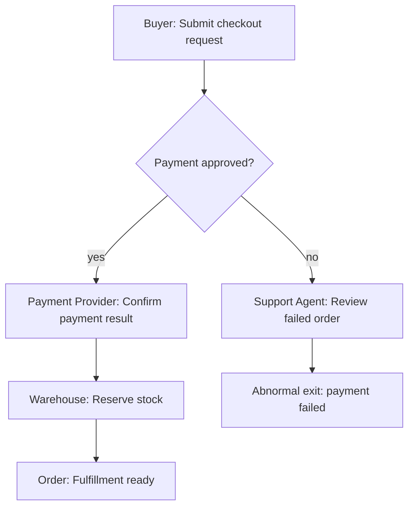

# Activity Map Block

用于解释 flow 的业务主链路：谁在什么条件下做什么业务动作，在哪里分支、汇合、异常退出，以及责任如何跨角色交接。

Activity map 先帮助读者理解业务推进方式，再把实现证据作为锚点补在旁边。它不是 Controller、Service、SQL、runtime adapter、payload 或文件清单的可视化。

## 适合使用时机

- flow 有清楚的业务起点、终点和触发条件。
- 多个 actor、角色、系统或人工岗位共同推进同一流程。
- 主链路包含条件分支、分支汇合、异常退出、回退或人工介入。
- 读者需要先理解“谁负责哪一步”，再继续阅读 sequence、state table、module 或 code anchors。
- 原始说明已经有证据锚点，但 dense prose 让主线、分支或交接关系不易扫描。

## 推荐表达

Activity map 默认优先使用 Mermaid `flowchart` 表达主活动图。只要 flow 存在多个 actor、分支、汇合、异常退出、回退或跨角色交接，主表达就应该是 Mermaid，而不是活动表。

活动表只能在两类情况下作为主表达：

- flow 很短、线性、无分支和无跨角色交接，表格比图更容易读。
- 当前证据还不足以确认稳定主活动图，只能暂存为候选步骤，并明确保留不确定性。

活动表更常见的用途是补充 Mermaid：承载 evidence anchors、条件说明、异常说明或节点解释，而不是替代主活动图。



```md
| Activity node | Actor | Condition | Business activity | Branch / join | Evidence |
| --- | --- | --- | --- | --- | --- |
| A | Buyer | Cart is ready | Submit checkout request | Mainline starts | `src/checkout/routes.ts` |
| C | Payment Provider | Payment approved | Confirm payment result | Joins fulfillment path | `/webhooks/payment` |
| E | Support Agent | Payment failed or risk flagged | Review failed order | Abnormal exit or manual recovery | `docs/support-orders.md` |
```

## 写作要求

- 先写 business mainline：从触发到正常终点的最短稳定路径。
- 标明 actors：用户角色、业务岗位、外部系统、主要运行单元或页面承接方。名称应复用 wiki 中已确认的 canonical names。
- 标明 conditions：触发条件、进入分支的条件、汇合条件和终止条件。
- 标明 branches：用业务条件命名分支，不要用 `if flag`、`switch status` 这类实现表达代替业务含义。
- 标明 joins：多个分支回到同一业务节点时，说明汇合后的共同结果。
- 标明 exceptions：异常、失败、超时、取消、拒绝、回退、人工介入或不可恢复终止都应保留为 abnormal exit。
- 标明 cross-role handoffs：流程责任从一个 actor 移交到另一个 actor 时，写清交接条件和接收方继续做的业务动作。
- 复杂 flow 的 Mermaid 节点应使用稳定、可引用的短标签；需要下钻、映射或反复引用时，给节点分配稳定编号或稳定别名。
- 多 actor 或多视角 flow 可以用 Mermaid `class` / `classDef` 或等价样式区分视角；样式服务于读者理解，不承载状态、风险或优先级。
- 保留 evidence anchors：每个关键活动、分支或 abnormal exit 至少应能追溯到简短路径、路由、符号名、文档位置、测试或用户确认。
- 不确定的业务意图要保留为不确定性，不要为了让图更完整而补猜活动。

## Activity Label 规则

Activity label 必须是读者能理解的业务或系统动作，例如：

- Buyer submits checkout request.
- Payment Provider confirms payment result.
- Support Agent reviews failed order.
- Order becomes fulfillment ready.

Activity label 不能是实现层项目，例如：

- Controller、Service、Repository、Mapper、DAO、Job、Listener、Consumer、Adapter。
- SQL、表名、字段名、DTO、VO、payload、JSON key、request body、response body。
- runtime adapter、SDK wrapper、client class、config file、file list。
- `src/**` 文件路径、方法名、日志名、测试名或部署脚本。

实现层项目可以作为 evidence anchors，不能替代业务活动本身。如果只能写出实现标签，说明 flow 的业务含义还没有被证据或用户确认支撑，应保留为问题或候选说明。

## 与其他 Blocks 的关系

- Activity map 是 flow 页面优先使用的主线结构，用来回答“谁在什么条件下做什么”。
- Sequence block 用来补充某个关键场景中的调用顺序、消息往返、回调、重试或异步协作。
- State Transition block 用来补充核心对象或流程的稳定状态变化。
- Prose 用来交代背景、范围、证据限制、导航关系或简单线性流程，不要把复杂分支塞回长段落。

## 避免

- 把普通调用链包装成业务主链路。
- 用活动表替代有分支、汇合、异常退出或跨角色交接的主活动图。
- 把 Controller、Service、SQL、payload 或文件路径写成主要活动。
- 用技术条件遮蔽业务条件。
- 删除异常路径、失败终点、人工处理或跨角色交接，只保留 happy path。
- 为了图形对称而合并不同业务分支、猜测汇合点或改写不确定性。
- 因为 Mermaid 表达需要整理节点，就退回长表格或大段 prose。
- 把证据锚点写成大段代码索引；证据应短而可追溯。
