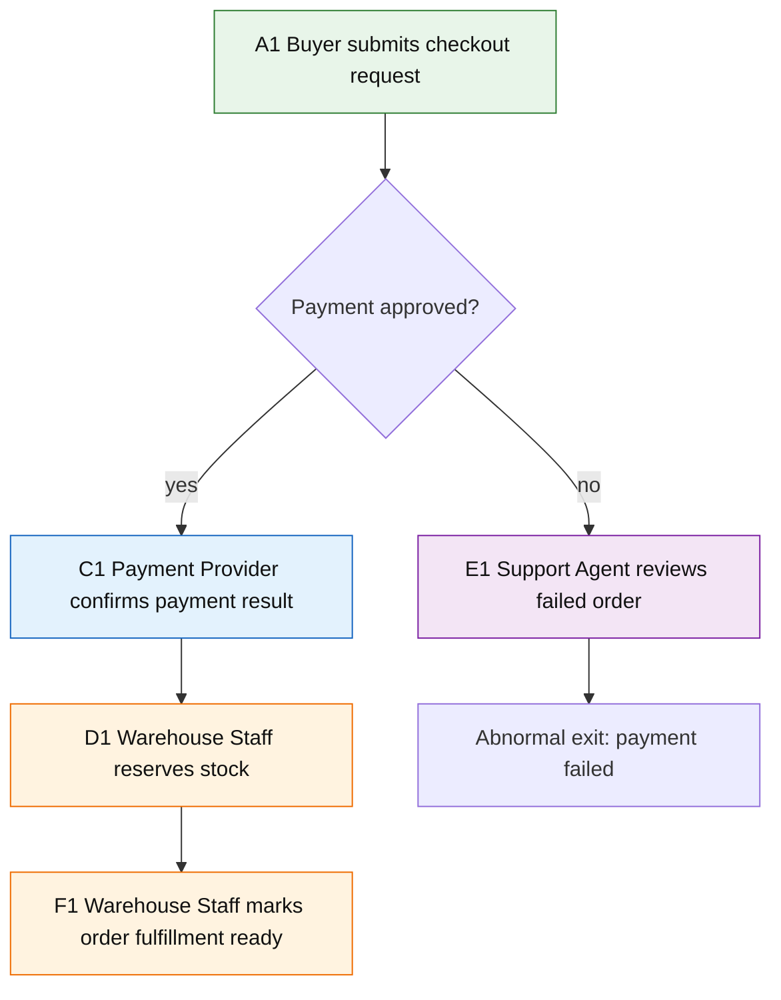

# Activity Map Block

用于解释 flow 的业务主链路：谁在什么条件下做什么业务动作，在哪里分支、汇合、异常退出，以及责任如何跨角色交接。

Activity map 先帮助读者理解业务推进方式，再把实现证据作为锚点补在旁边。它不是 Controller、Service、SQL、runtime adapter、payload 或文件清单的可视化。

## 适合使用时机

- flow 有清楚的业务起点、终点和触发条件。
- 多个 actor、角色、系统或人工岗位共同推进同一流程。
- 主链路包含条件分支、分支汇合、异常退出、回退或人工介入。
- 读者需要先理解“谁负责哪一步”，再继续阅读 sequence、state table、module 或 code anchors。
- 原始说明已经有证据锚点，但 dense prose 让主线、分支或交接关系不易扫描。

## 推荐表达

Activity map 默认优先使用 Mermaid `flowchart` 表达主活动图。只要 flow 存在多个 subject、分支、汇合、异常退出、回退或跨角色交接，主表达就应该是 Mermaid，而不是活动表。

活动表只能在两类情况下作为主表达：

- flow 很短、线性、无分支和无跨角色交接，表格比图更容易读。
- 当前证据还不足以确认稳定主活动图，只能暂存为候选步骤，并明确保留不确定性。

活动表更常见的用途是补充 Mermaid：承载 evidence anchors、条件说明、异常说明或节点解释，而不是替代主活动图。



```md
| Activity node | Subject | Condition | SVO business activity | Branch / join | Evidence |
| --- | --- | --- | --- | --- | --- |
| A1 | Buyer | Cart is ready | Buyer submits checkout request | Mainline starts | `src/checkout/routes.ts` |
| C1 | Payment Provider | Payment approved | Payment Provider confirms payment result | Joins fulfillment path | `/webhooks/payment` |
| E1 | Support Agent | Payment failed or risk flagged | Support Agent reviews failed order | Abnormal exit or manual recovery | `docs/support-orders.md` |
```

## 写作要求

- 先写 business mainline：从触发到正常终点的最短稳定路径。
- 标明 subjects：用户角色、业务岗位、外部系统、主要运行单元、页面承接方或 module。名称必须来自 wiki 中已经确认的 canonical names，或来自当前 flow 页面先声明且有证据锚点的 actor / subject list；不能在活动节点里临时发明主语。Canonical Roles 只要参与该流程，就天然适合作为 Subject；Canonical Models 不适合作为 Activity Subject，只能作为动作对象、状态载体、相关模型或 evidence anchor。
- 保持抽象层次：同一张 Activity Map 可以把 Canonical Roles 和一种非 Role subject family 放在一起；除 Roles 外，其他 Subject 应来自同一种 canonical index 类型或同一种 flow-local 抽象层。不要把 Page、Module、Runtime Unit、External System 和实现组件放在同一张主活动图里当同级主语。需要跨层说明时，保留主图在一个层级，把下钻放进 sequence、局部 activity map、Object、条件、证据或相关页面。
- Activity node label 必须采用 SVO 业务动作短句。推荐形态为 `<stable-node-id> <Subject> <verb + business object>`，例如 `A1 Buyer submits checkout request`。分支、汇合和异常终点可以使用条件或结果标签，但不能伪装成业务活动节点。
- 标明 conditions：触发条件、进入分支的条件、汇合条件和终止条件。
- 标明 branches：用业务条件命名分支，不要用 `if flag`、`switch status` 这类实现表达代替业务含义。
- 标明 joins：多个分支回到同一业务节点时，说明汇合后的共同结果。
- 标明 exceptions：异常、失败、超时、取消、拒绝、回退、人工介入或不可恢复终止都应保留为 abnormal exit。
- 标明 cross-role handoffs：流程责任从一个 actor 移交到另一个 actor 时，写清交接条件和接收方继续做的业务动作。
- 复杂 flow 的 Mermaid 节点应使用稳定、可引用的短标签；需要下钻、映射或反复引用时，给节点分配稳定编号或稳定别名。
- 同一 Subject 的活动节点使用同一个 Mermaid `class`；不同 Subject 必须使用不同 `class` / `classDef` 或等价样式分色。颜色只区分 Subject / perspective，不承载状态、风险、优先级或 Component 归属。
- 保留 evidence anchors：每个关键活动、分支或 abnormal exit 至少应能追溯到简短路径、路由、符号名、文档位置、测试或用户确认。
- 不确定的业务意图要保留为不确定性，不要为了让图更完整而补猜活动。

## Stable Nodes And Drill-Down

复杂 flow 应有一个清楚的主 activity map。后续 sequence、state transition、page navigation、dependency map、evidence table 或局部 drill-down，都应回到主 activity map 的节点、边或连续子链。

Drill-down 图可以解释某个活动节点内部如何协作，也可以高亮一段主链路，但它不能重新定义另一套主业务流程。需要展示局部视角时，复用主图的稳定节点名、短编号或别名，并说明“本段从哪个活动节点 / 哪条边 / 哪段子链下钻”。

活动节点的 Subject 必须复用 wiki 中已确认的 canonical roles、external systems、main runtime units、pages、modules，或者复用当前 flow 页面已经声明并有证据支撑的 subject list。除 Roles 外，同一张图的其他 Subject 应保持同一种 canonical index 类型或同一种 flow-local 抽象层。Canonical Models 不做 Activity Subject：如果需要表达 model 的创建、读取、更新、终止或状态变化，把 model 写进 SVO 的 Object、state transition、相关模型或 evidence anchor。Subject 不能是 DTO、payload、record、SQL、adapter、helper、method、文件路径或临时状态名。如果只能写出实现名或 model 名，说明它更适合作为 evidence anchor、sequence participant 说明、state transition 或候选问题，不应成为 activity node。

## Activity Label 规则

Activity label 必须是读者能理解的业务或系统动作，例如：

- A1 Buyer submits checkout request.
- C1 Payment Provider confirms payment result.
- E1 Support Agent reviews failed order.
- F1 Warehouse Staff marks order fulfillment ready.

Activity label 不能是实现层项目，例如：

- Controller、Service、Repository、Mapper、DAO、Job、Listener、Consumer、Adapter。
- SQL、表名、字段名、DTO、VO、payload、JSON key、request body、response body。
- runtime adapter、SDK wrapper、client class、config file、file list。
- `src/**` 文件路径、方法名、日志名、测试名或部署脚本。

实现层项目可以作为 evidence anchors，不能替代业务活动本身。如果只能写出实现标签，说明 flow 的业务含义还没有被证据或用户确认支撑，应保留为问题或候选说明。

## 与其他 Blocks 的关系

- Activity map 是 flow 页面优先使用的主线结构，用来回答“谁在什么条件下做什么”。
- Sequence block 用来补充某个关键场景中的调用顺序、消息往返、回调、重试或异步协作。
- State Transition block 用来补充核心对象或流程的稳定状态变化。
- Prose 用来交代背景、范围、证据限制、导航关系或简单线性流程，不要把复杂分支塞回长段落。

## 避免

- 把普通调用链包装成业务主链路。
- 用活动表替代有分支、汇合、异常退出或跨角色交接的主活动图。
- 在 drill-down 图里悄悄改写主 activity map 的节点含义、边方向或异常出口。
- 把没有 canonical 来源或当前页面声明的词写成 Subject。
- 省略 Subject，让节点退化成动宾短语、名词短语或技术处理名。
- 多 Subject 活动图不分色，或用颜色表达状态、风险、优先级和 Component 归属。
- 把 Controller、Service、SQL、payload 或文件路径写成主要活动。
- 用技术条件遮蔽业务条件。
- 删除异常路径、失败终点、人工处理或跨角色交接，只保留 happy path。
- 为了图形对称而合并不同业务分支、猜测汇合点或改写不确定性。
- 因为 Mermaid 表达需要整理节点，就退回长表格或大段 prose。
- 把证据锚点写成大段代码索引；证据应短而可追溯。
