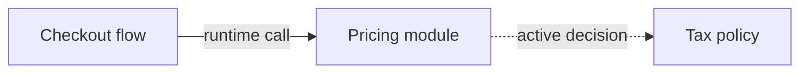

# Dependency Map Block

用于解释 page、module、model、flow 或运行单元之间的依赖和协作关系。

## 适合使用时机

- 多个对象之间存在稳定协作。
- 读者需要知道依赖方向。
- 某个关系容易被误认为反向关系或运行时调用。
- 读者需要区分当前稳定事实和仍在治理或讨论中的 active decision。
- 同一张图或表中可能混合运行时调用、数据引用、owner 关系、事实来源或 decision link。

## 推荐表达

Dependency map 的表达方式取决于读者问题：

- 多个对象形成依赖拓扑、方向容易看反、或读者需要先理解网络结构时，优先使用 Mermaid `flowchart` / `graph`。
- 关系类型混合、证据和稳定性判断更重要时，使用依赖表。
- 只有一两个简单关系时，可以用短列表或 prose，但仍要写清方向、关系类型、稳定性和依据。

无论用图还是表，关键是说明方向、关系类型、稳定性和依据。表格常用于补充 Mermaid 图中的 evidence、active decision 和 uncertainty，而不是替代需要看清拓扑的依赖图。



```md
| From | To | Relationship type | Stable fact or active decision | Why it matters | Evidence or decision link |
| --- | --- | --- | --- | --- | --- |
| Checkout flow | Pricing module | Runtime call | Stable fact | Checkout total depends on pricing result | `src/checkout/PricingGateway.ts` |
| Pricing module | Tax policy | Ownership boundary | Active decision | Ownership is being decided, so do not present it as final | `06-decisions.md#tax-policy-owner` |
```

## 写作要求

- 明确方向。
- 区分运行时调用、数据引用、职责依赖和事实来源。
- 说明证据来源。
- 标明关系是 stable fact 还是 active decision。
- Stable fact 可以来自当前 repo 证据、用户确认或已有 wiki 中可追溯的稳定信息。
- Active decision 需要指向 decision-tradeoff block、Drift Page item 或用户待确认点，不能写成已经稳定的系统事实。
- 如果一条关系只是候选解释，写成 uncertainty 或 candidate note，不要画成确定依赖。
- 如果只是 owner、数据依赖或模型关系，不要推断成运行时调用。
- 保留 unique facts 和 evidence anchors；把依赖改成表格时不要合并掉方向、条件、版本差异或例外。
- 多节点依赖图需要下钻或跨页引用时，使用稳定名称或稳定别名，不要依赖临时描述消歧。

## 示例使用条件

当 module page 写到“Order 依赖 Pricing”，但上下文里同时存在两类信息时，用 Dependency Map Block 分开表达：

- Stable fact: `OrderService` 调用 `PricingClient` 计算订单金额，证据是源码或测试。
- Active decision: “Tax policy 应该归 Pricing 还是 Compliance”仍在 `06-decisions.md` 讨论，不能写成模块事实。
- Uncertainty: 如果只有旧文档提到 Compliance，当前代码未验证，保留 evidence anchor 并标出不确定。

## 避免

- 只有箭头，没有关系含义。
- 用表格替代需要看清拓扑、方向或跨对象网络的依赖图。
- 把数据库外键等同于模块调用。
- 把模型 owner 当成运行时调用方。
- 在一张图里混合太多抽象层级。
- 把 active decision、候选 ownership 或待确认边界写成稳定依赖事实。
