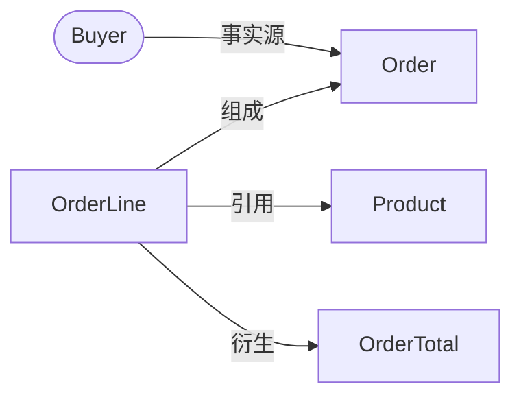
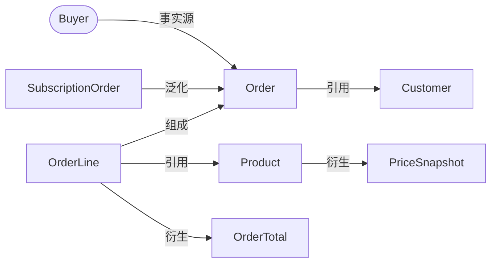

# Model Relation Block

用于解释 model family page 里一组高度相关 model 的稳定概念关系、事实来源主体和可追溯证据。这个 block 只描述关系图本体和边的 evidence / uncertainty，不承载字段明细、生命周期步骤、完整事实口径、运行时调用链、模块依赖或数据库结构清单。

## 适合使用时机

- 一个 model family 包含多个 model，或需要表达 Canonical Role / Canonical External System 如何成为某个 model 的事实来源主体。
- 关系方向容易混淆，例如直接引用和派生事实容易被写成同一种依赖。
- 页面需要同时保留证据、不确定性和 source-of-truth 说明。
- prose 已经太密，读者必须重新拼关系才能理解这组 model。

## 关系图本体

关系图本体只允许两类节点：

- Model 节点：稳定系统理解模型，使用矩形节点，例如 `Order["Order"]`。
- Fact-source subject 节点：已经确认的 Canonical Role 或 Canonical External System，使用 stadium / 椭圆节点，例如 `Buyer(["Buyer"])`。

Fact-source subject 节点必须来自 `wiki/01-system.md` 的 Canonical Roles / Canonical External Systems，或来自当前页面先声明且有证据的 page-local subject。节点 label 的第一行必须是稳定主体名称；如需补充动作、采集方式或说明，放在第二行、图下表或 evidence 中。

不要把字段、表字段、DTO、Controller、Service、module、adapter、payload、record、runtime event、session、日志、页面按钮或行为短句画成 `model-relation` 节点。它们可以作为 evidence、关键字段、事实来源说明或实现备注出现，但不属于关系图本体。

## 关系标签

使用这些自然语言标签描述关系。方向要写清楚，必要时用一句话解释为什么这样连。

| Label | Direction | Meaning | Use carefully |
| --- | --- | --- | --- |
| 泛化 | special model -> general model | 前者是后者的更具体形态，读者需要知道它继承或细化了哪个共同概念。 | 不要因为名字相似就写泛化；需要有共享含义、接口、规则或用户确认。 |
| 组成 | part -> whole | 前者是后者的一部分，whole 的含义需要这些 part 才完整。 | 不要自动推断生命周期所有权、级联删除或存储嵌套，除非有证据。 |
| 引用 | referrer -> referent | 前者保存、展示、指向或使用后者的身份、上下文或当前事实。 | 引用只说明直接指向或使用，不说明事实被复制、计算、快照或聚合。 |
| 衍生 | source -> derived fact/model | 后者由前者计算、复制、聚合、规范化或快照而来。 | 衍生要说明刷新、时效或不确定性；不要把普通外键、id 或 lookup 写成衍生。 |
| 事实源 | canonical role / external system -> model | 前者是这个 model 事实成立的外部主体来源。 | 事实源只从 Canonical Role 或 Canonical External System 指向 Model；不要用于字段、规则、Service、adapter 或 model-to-model 关系。 |

Model 与 Model 之间只使用 `泛化`、`组成`、`引用`、`衍生`。Fact-source subject 与 Model 之间只使用 `事实源`。

## 引用和衍生的区别

保留 `引用` 和 `衍生` 的区别是这个 block 的重点。

- 如果 A 只是保存 B 的 id、链接到 B、展示 B 当前值或在流程里读取 B，写 `A 引用 B`。
- 如果 C 的值是从 B 计算、复制、快照、汇总或转换而来，写 `B 衍生 C`。
- 如果同一处同时存在 identity reference 和 derived snapshot，拆成两行，不要用一个模糊关系吞掉差异。
- 如果证据只能证明“有关联”，但不能证明是引用还是衍生，保留 uncertainty，不要猜成稳定关系。

示例：

```md
| From | Relationship | To | Meaning | Evidence | Uncertainty |
| --- | --- | --- | --- | --- | --- |
| `OrderLine` | 引用 | `Product` | line 保存 product identity，用来回到当前商品上下文。 | `src/order/OrderLine.ts` 中的 `productId` | 只能证明 identity reference，不能证明商品名称被复制。 |
| `Product` | 衍生 | `PriceSnapshot` | snapshot 是下单时从 Product 定价事实复制出来的独立展示事实。 | `src/order/createOrder.ts` 中的 snapshot assignment | 未确认商品改价后是否重算历史快照。 |
```

## Model 成立依据

每个新增 model、焦点 model 或关系图要解释的结果 model，都应该能回答“它什么时候、由谁或由什么依据构建 / 成立”。

成立依据通常来自两类边：

- Canonical Role / Canonical External System 到 Model 的 `事实源`。
- 其他 Model 到结果 Model 的 `衍生`。

`引用`、`组成` 和 `泛化` 只能说明依赖、结构或类型关系，不能单独解释一个 model 自身何时成立。一个结果 model 如果只有 `引用` 边，读者仍然不知道它如何成立；应补充 `事实源`、`衍生` 成立依据，或在图下说明它是外部既有 model / 本图不展开。

对 view model、projection、summary、snapshot、state 这类结果 model，分开表达“自身如何成立”和“它引用哪些源对象”：用 `衍生` 说明自身由哪个上游 model、状态或规则构建，用 `引用` 说明它保留哪些 source、evidence、session 或 context ref。

如果找不到事实源、衍生来源，也无法说明它是外部既有 model，优先把该节点降级为关键字段、状态、口径说明或待确认项，不要把它伪装成已闭环 model。

## 推荐表达

Model relation 默认优先使用 Mermaid `flowchart` 或等价关系图表达关系本体。只要 model family 关系包含多节点、多方向、事实源、`引用` / `衍生` 区分或读者需要看清拓扑，主表达就应该是关系图，而不是关系表。

关系表适合两类内容：

- 关系很少、线性，短 prose 或表格比图更清楚。
- 作为 Mermaid 旁边的补充表，承载每条边的 meaning、evidence 和 uncertainty。

关系图的边标签必须写明关系分类。图节点应保持同一抽象层级，只使用 Model 节点和 Fact-source subject 节点。数据库表、DTO、字段、Controller、Service、页面按钮、module、adapter、payload、record、runtime event 和日志都不能混进关系图本体，除非它们在当前页面被明确提升为稳定系统理解 Model 且有证据。



```md
| From | Relationship | To | Meaning | Evidence | Uncertainty |
| --- | --- | --- | --- | --- | --- |
| ... | 引用 | ... | ... | ... | ... |
```

如果页面主要要解释“哪个字段、规则或计算结果以哪里为准”，把 source-of-truth facts 放到 model page 的事实来源、关键字段或规则说明中。不要把字段级 source-of-truth 小表塞进 `model-relation` 图本体。

## 写作要求

- 每一行都让读者看清方向、关系标签、关系含义和证据锚点。
- Mermaid 关系图中的每条边都要写清关系标签，不能只画箭头。
- 需要反复引用、下钻或跨页对齐的模型关系，使用稳定 model 名称或稳定别名；不要依赖临时描述消歧。
- 关系对象保持同一抽象层级；不要把 model、SQL 表、DTO、Controller、Service、module、字段、页面按钮混在一张图或关系表里，除非正在解释边界差异且已明确谁是 Model、谁只是 evidence。
- `事实源` 的起点必须是 Canonical Role 或 Canonical External System；不要把“上传动作”“runtime 记录”“adapter 输出”“payload 字段”“Service 计算”“日志写入”写成事实来源主体。
- 新增 model、焦点 model 或结果 model 不能只有 `引用` 边；必须补 `事实源`、`衍生` 成立依据，或说明它是外部既有 / 本图不展开。
- 证据锚点保持短而可追溯，可以是路径、符号名、路由、配置、测试、已有 wiki 页面或用户确认。
- 不确定性要留在关系旁边，例如“只证明当前实现”“未确认业务意图”“未验证异常分支”。

## 避免

- 用箭头或表格行替代关系含义。
- 用关系表替代需要看清拓扑、多方向或事实源的模型关系图。
- 把运行时调用、模块依赖、数据库外键、字段共现全部写成 model relationship。
- 把 `引用` 和 `衍生` 合并成“依赖”“关联”“使用”这类模糊词。
- 把 action phrase、runtime artifact、payload、record、adapter、Service、module、日志或字段当成 `事实源` 主体。
- 把字段、表字段、DTO、Controller、Service、module 或页面按钮画成 model-relation 节点。
- 用一组 `引用` 边替代 model 自身的成立依据。
- 因为表格好看而制造空关系，或隐藏 evidence/uncertainty。

## Representative Example

下面示例展示 model family page 可以怎样同时呈现关系、事实源、证据和 uncertainty。示例路径是格式演示；实际 wiki 页面必须替换为目标 repo 的真实锚点。



```md
### Order Model Relationship Evidence

| From | Relationship | To | Meaning | Evidence | Uncertainty |
| --- | --- | --- | --- | --- | --- |
| `Buyer` | 事实源 | `Order` | buyer action establishes the order fact. | checkout submit flow and order creation route | 未确认 support-created orders 是否同属同一事实来源。 |
| `SubscriptionOrder` | 泛化 | `Order` | subscription order follows the shared order concept, with renewal-specific rules. | `src/orders/SubscriptionOrder.ts` extends `Order` | 未确认业务是否把 one-time order 和 subscription order 视为同一 catalog family。 |
| `OrderLine` | 组成 | `Order` | order total and fulfillment need the set of order lines. | `src/orders/Order.ts` exposes `lines` | 只证明 current code shape；不证明 deletion ownership。 |
| `Order` | 引用 | `Customer` | order keeps customer identity for account context. | `src/orders/Order.ts` field `customerId` | 不说明 customer profile facts are copied into order. |
| `OrderLine` | 引用 | `Product` | line keeps product identity for current product context and later verification. | `src/orders/OrderLine.ts` field `productId` | 不说明 product facts are copied into line. |
| `Product` | 衍生 | `PriceSnapshot` | snapshot is copied from product pricing facts when the order line is created. | `src/orders/createOrder.ts` assigns snapshot fields | 未确认 price correction flow 是否重算 historical lines。 |
| `OrderLine` | 衍生 | `OrderTotal` | total is calculated from order line facts and pricing rules, then read as its own model. | pricing calculation code and `OrderTotalTest` | Promotions override rules need a separate evidence pass. |
```
