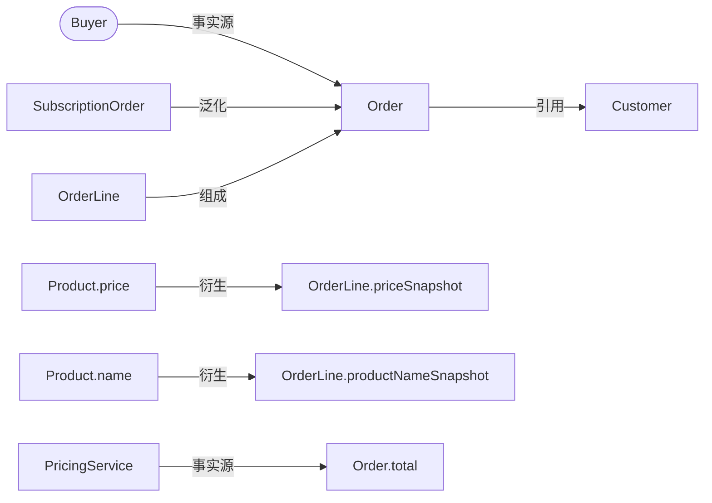

# Model Relation Block

用于解释 model 页面里的稳定概念关系、事实来源和可追溯证据。这个 block 关注 reader 能否看懂 model 之间的含义关系，不用于表达普通调用链、模块依赖或数据库结构清单。

## 适合使用时机

- 一个 model 和多个 model、角色、外部系统或关键事实有关联。
- 关系方向容易混淆，例如直接引用和派生事实容易被写成同一种依赖。
- 页面需要同时保留证据、不确定性和 source-of-truth 说明。
- prose 已经太密，读者必须重新拼关系才能理解 model。

## 关系标签

使用这些自然语言标签描述关系。方向要写清楚，必要时用一句话解释为什么这样连。

| Label | Direction | Meaning | Use carefully |
| --- | --- | --- | --- |
| 泛化 | special model -> general model | 前者是后者的更具体形态，读者需要知道它继承或细化了哪个共同概念。 | 不要因为名字相似就写泛化；需要有共享含义、接口、规则或用户确认。 |
| 组成 | part -> whole | 前者是后者的一部分，whole 的含义需要这些 part 才完整。 | 不要自动推断生命周期所有权、级联删除或存储嵌套，除非有证据。 |
| 引用 | referrer -> referent | 前者保存、展示、指向或使用后者的身份、上下文或当前事实。 | 引用只说明直接指向或使用，不说明事实被复制、计算、快照或聚合。 |
| 衍生 | source -> derived fact/model | 后者由前者计算、复制、聚合、规范化或快照而来。 | 衍生要说明刷新、时效或不确定性；不要把普通外键、id 或 lookup 写成衍生。 |
| 事实源 | source -> fact/model | 前者是某个事实、字段、规则或 model 解释的权威来源。 | 事实源用于消除“哪里说了算”的歧义，不要给每个普通字段都加。 |

## 引用和衍生的区别

保留 `引用` 和 `衍生` 的区别是这个 block 的重点。

- 如果 A 只是保存 B 的 id、链接到 B、展示 B 当前值或在流程里读取 B，写 `A 引用 B`。
- 如果 C 的值是从 B 计算、复制、快照、汇总或转换而来，写 `B 衍生 C`。
- 如果同一处同时存在 identity reference 和 derived snapshot，拆成两行，不要用一个模糊关系吞掉差异。
- 如果证据只能证明“有关联”，但不能证明是引用还是衍生，保留 uncertainty，不要猜成稳定关系。

示例：

```md
| From | Relationship | To | Meaning | Evidence | Uncertainty |
| --- | --- | --- | --- | --- | --- |
| `OrderLine` | 引用 | `Product` | line 保存 product identity，用来回到当前商品上下文。 | `src/order/OrderLine.ts` 中的 `productId` | 只能证明 identity reference，不能证明商品名称被复制。 |
| `Product.name` | 衍生 | `OrderLine.productNameSnapshot` | line 上的展示名来自下单时的商品名快照。 | `src/order/createOrder.ts` 中的 snapshot assignment | 未确认商品改名后是否重算。 |
```

## 推荐表达

Model relation 默认优先使用 Mermaid `flowchart` 或等价关系图表达关系本体。只要 model 关系包含多节点、多方向、事实源、`引用` / `衍生` 区分或读者需要看清拓扑，主表达就应该是关系图，而不是关系表。

关系表适合两类内容：

- 关系很少、线性，短 prose 或表格比图更清楚。
- 作为 Mermaid 旁边的补充表，承载每条边的 meaning、evidence 和 uncertainty。

关系图的边标签必须写明关系分类。图节点应保持同一抽象层级，优先使用 model 和事实来源角色，不把 SQL 表、DTO、Controller、页面按钮或普通字段混进关系图本体。


```md
| From | Relationship | To | Meaning | Evidence | Uncertainty |
| --- | --- | --- | --- | --- | --- |
| ... | 引用 | ... | ... | ... | ... |
```

如果页面主要要解释“哪个事实以哪里为准”，可以单独放一个 source-of-truth facts 小表：

```md
| Fact | Source of truth | Applies to | Evidence | Uncertainty |
| --- | --- | --- | --- | --- |
| ... | ... | ... | ... | ... |
```

## 写作要求

- 每一行都让读者看清方向、关系标签、关系含义和证据锚点。
- Mermaid 关系图中的每条边都要写清关系标签，不能只画箭头。
- 需要反复引用、下钻或跨页对齐的模型关系，使用稳定 model 名称或稳定别名；不要依赖临时描述消歧。
- 关系对象保持同一抽象层级；不要把 model、SQL 表、DTO、Controller、页面按钮混在一张表里，除非正在解释边界差异。
- `事实源` 的起点应是 canonical role、external system 或明确事实来源；不要把“上传动作”“runtime 记录”“adapter 输出”“payload 字段”写成事实来源角色。
- 如果一个结果 model 只有 `引用` 边，读者仍然不知道它如何成立；应补充事实源、衍生来源、外部既有说明或 uncertainty。
- 证据锚点保持短而可追溯，可以是路径、符号名、路由、配置、测试、已有 wiki 页面或用户确认。
- 不确定性要留在关系旁边，例如“只证明当前实现”“未确认业务意图”“未验证异常分支”。
- source-of-truth facts 要说明“哪个事实由谁说了算”，不要只写 owner 名称。

## 避免

- 用箭头或表格行替代关系含义。
- 用关系表替代需要看清拓扑、多方向或事实源的模型关系图。
- 把运行时调用、模块依赖、数据库外键、字段共现全部写成 model relationship。
- 把 `引用` 和 `衍生` 合并成“依赖”“关联”“使用”这类模糊词。
- 把 action phrase、runtime artifact、payload、record、adapter 或日志当成 `事实源` 角色。
- 因为表格好看而制造空关系，或隐藏 evidence/uncertainty。

## Representative Example

下面示例展示 model 页面可以怎样同时呈现关系、事实源、证据和 uncertainty。示例路径是格式演示；实际 wiki 页面必须替换为目标 repo 的真实锚点。



```md
### Order Model Relationship Evidence

| From | Relationship | To | Meaning | Evidence | Uncertainty |
| --- | --- | --- | --- | --- | --- |
| `Buyer` | 事实源 | `Order` | buyer action establishes the order fact. | checkout submit flow and order creation route | 未确认 support-created orders 是否同属同一事实来源。 |
| `SubscriptionOrder` | 泛化 | `Order` | subscription order follows the shared order concept, with renewal-specific rules. | `src/orders/SubscriptionOrder.ts` extends `Order` | 未确认业务是否把 one-time order 和 subscription order 视为同一 catalog family。 |
| `OrderLine` | 组成 | `Order` | order total and fulfillment need the set of order lines. | `src/orders/Order.ts` exposes `lines` | 只证明 current code shape；不证明 deletion ownership。 |
| `Order` | 引用 | `Customer` | order keeps customer identity for account context. | `src/orders/Order.ts` field `customerId` | 不说明 customer profile facts are copied into order. |
| `Product.price` | 衍生 | `OrderLine.priceSnapshot` | line price is copied from product price when the order is created. | `src/orders/createOrder.ts` assigns `priceSnapshot` | 未确认 price correction flow 是否重算 historical lines。 |
| `PricingService` | 事实源 | `Order.total` | total is calculated by pricing rules rather than by summing display fields manually. | `src/pricing/PricingService.ts` and `OrderTotalTest` | Promotions override rules need a separate evidence pass. |
```
