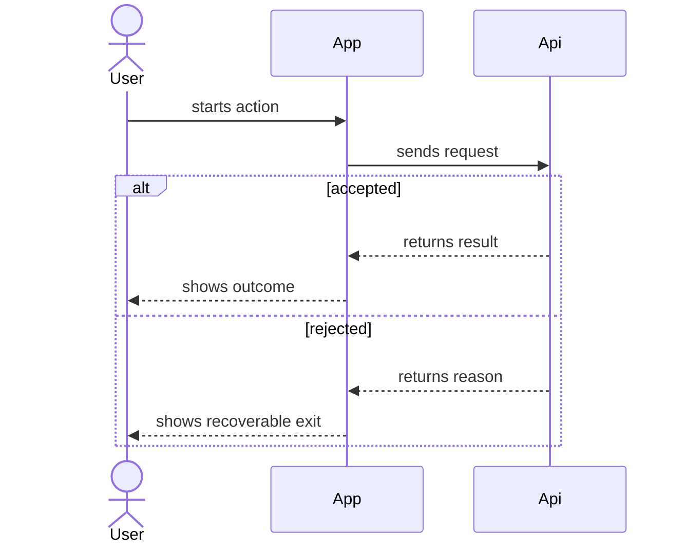

# Sequence Block

用于解释一个关键场景中的参与方协作和调用顺序。

## 适合使用时机

- 需要说明关键调用顺序。
- 读者需要知道谁先触发、谁响应、最终得到什么结果。
- 存在分支、回调、重试、异步协作或异常退出。
- 单纯活动图不足以解释参与方之间的交互。
- flow 页面已经说明主业务路径，但某个关键片段还需要解释 actor order。

## 推荐表达

Sequence 默认优先使用 Mermaid `sequenceDiagram` 表达关键参与方协作。只要场景存在多个系统参与方、回调、重试、异步协作、分支或异常退出，主表达就应该是 Mermaid，而不是步骤表。

步骤表只能在两类情况下作为主表达：

- 序列很短、线性、无分支，表格比图更容易读。
- 当前证据还不足以确认完整调用顺序，只能暂存为候选步骤，并明确保留不确定性。

步骤表更常见的用途是补充 Mermaid：承载 evidence anchors、outcome、branch condition 或异常出口说明，而不是替代时序图。



```md
| Order | Actor | Message or action | Outcome | Branch or exit | Evidence |
| --- | --- | --- | --- | --- | --- |
| 1 | User | Starts checkout from cart | Checkout request begins | Normal path | `src/routes/cart.ts` |
| 2 | App | Calls pricing API | Total is calculated | If pricing fails, checkout stops with retry message | `src/checkout/PricingGateway.ts` |
```

## 写作要求

- 参与方保持同一抽象层级。
- 系统参与方应选择同一层级的业务或系统边界；不要在同一张图里混用系统、module、component、class、method 和 table。
- 推荐使用稳定 alias，并在图后用短表说明 alias、显示名、边界层级和证据锚点。
- 用户、业务角色或人工岗位只作为触发者、协作者或结果接收者；不要把它们和内部实现类混成同一层级。
- 先写触发者和触发条件，再写正常顺序，最后写结果。
- 每个序列说明读者关心的 outcome，例如订单创建、页面可见状态、任务进入队列或人工接手。
- 分支要写清楚 branch condition，不要只写“if error”。
- 异常退出要写清楚是否可恢复、谁看到结果、后续去哪里处理。
- 每条关键消息说明业务或系统动作。
- 如果关键消息对应已确认的 public surface、contract、route、event、tool、command 或 module capability，应在消息说明或图后表格中绑定一个稳定 surface / contract，并保持一条消息只表达一个能力。
- 运行时调用要有代码、接口、路由或用户确认支撑。
- 如果调用顺序、异步回调或异常出口只有部分证据，保留 uncertainty，不要补成确定事实。
- 用户或人工角色只作为触发者或结果接收者，不混入内部技术层级。
- 不要为了压缩图而删除 unique facts、evidence anchors、限制条件或例外。

## 示例使用条件

当已有 flow 页面写了“用户提交订单后系统创建订单”，但证据还显示价格服务失败会提前退出时，可以增加 Sequence Block：

- Trigger: 用户在购物车点击提交。
- Actor order: User -> App -> Pricing API -> Order API -> App。
- Outcome: 订单创建或用户看到可恢复失败。
- Branches: pricing accepted / pricing rejected。
- Abnormal exits: pricing timeout 或库存校验失败，保留对应路由、接口或代码证据。

## 避免

- 用时序图替代主业务流程。
- 用步骤表替代有多参与方、分支、回调、重试、异步或异常出口的关键协作。
- 把 Controller、DTO、SQL、表等实现细节画成主要参与方。
- 在同一张图里混用不同抽象层级的参与方。
- 把 activity map 的主业务顺序拆散成多个互相竞争的 sequence。
- 一条消息混入多个不同含义的动作。
- 一条消息混入多个 public surfaces、contracts、routes、events 或 module capabilities。
- 把数据依赖或 owner 关系画成调用顺序。
- 只画 happy path，丢掉已知分支、异常出口或人工接手。
