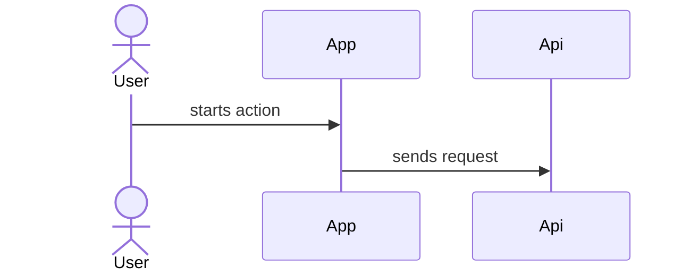

# Sequence Block

用于解释一个关键场景中的参与方协作和调用顺序。

## 适合使用时机

- 需要说明关键调用顺序。
- 存在分支、回调、重试或异步协作。
- 单纯活动图不足以解释参与方之间的交互。

## 推荐表达

优先使用 Mermaid `sequenceDiagram` 或简洁步骤表。

## 写作要求

- 参与方保持同一抽象层级。
- 每条关键消息说明业务或系统动作。
- 运行时调用要有代码、接口、路由或用户确认支撑。
- 用户或人工角色只作为触发者或结果接收者，不混入内部技术层级。

## 避免

- 用时序图替代主业务流程。
- 把 Controller、DTO、SQL、表等实现细节画成主要参与方。
- 一条消息混入多个不同含义的动作。
- 把数据依赖或 owner 关系画成调用顺序。
