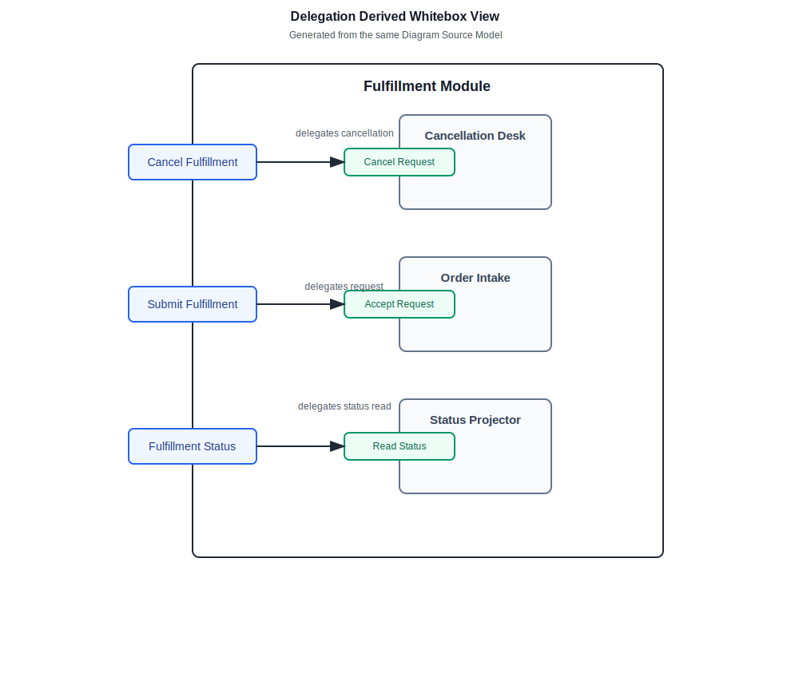
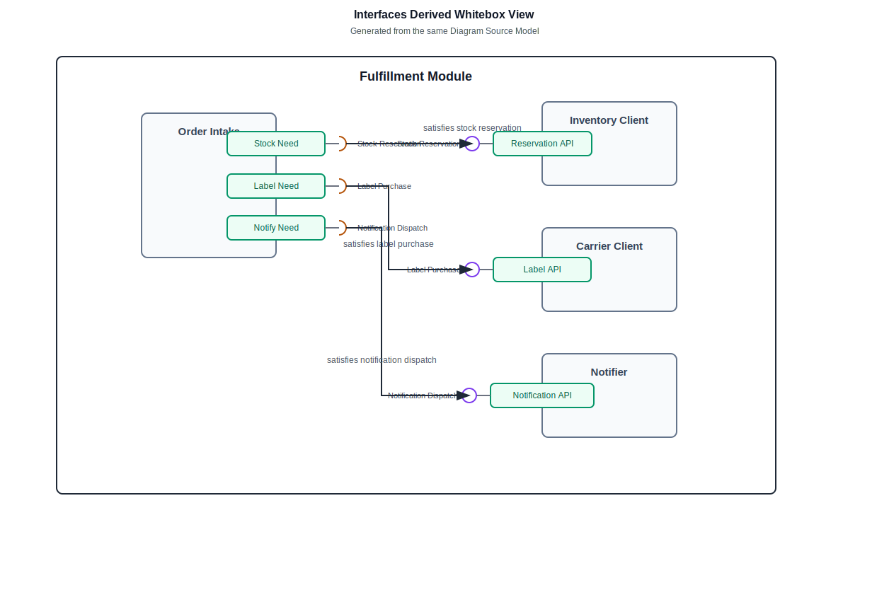

# Fulfillment Module

Fulfillment accepts paid checkout orders and starts stock reservation work.

Related reading: [Checkout flow](../02-flows/checkout.md) and [Inventory model](../05-models/inventory.md).

## 模块边界图（Module Boundary Map）

Source model: [`fulfillment.whitebox.yaml`](./fulfillment.whitebox.yaml) for the complete diagram and derived views below.

### Boundary Derived Whitebox View

### Delegation Derived Whitebox View

### Assembly Derived Whitebox View

### Interfaces Derived Whitebox View

Derived views are reader aids generated from the same source model; they do not replace the complete diagram.

Converted from the old module map without changing these confirmed facts:

- Checkout flow starts fulfillment through the Submit Fulfillment boundary port.
- Returns flow asks Fulfillment through the Cancel Fulfillment boundary port.
- Operations console reads fulfillment through the Fulfillment Status boundary port.
- Submit Fulfillment is delegated to Order Intake.
- Cancel Fulfillment is delegated to Cancellation Desk.
- Fulfillment Status is delegated to Status Projector.
- Order Intake delegates stock reservation needs to Inventory Client.
- Order Intake delegates label purchase needs to Carrier Client.
- Order Intake delegates notification dispatch needs to Notifier.
- Order Intake passes accepted orders to Order Writer.
- Order Writer publishes audit records to Audit Logger.

Evidence:

- Evidence: `src/fulfillment/FulfillmentController.ts`
- Evidence: `src/fulfillment/StatusController.ts`
- Evidence: `src/fulfillment/OrderIntake.ts`
- Evidence: `src/fulfillment/InventoryClient.ts`
- Evidence: `src/fulfillment/CarrierClient.ts`
- Evidence: `src/fulfillment/Notifier.ts`
- Evidence: `src/fulfillment/OrderWriter.ts`
- Evidence: `src/fulfillment/AuditLogger.ts`

Uncertainty preserved:

- Manual cancellation follow-up is mentioned as a future boundary candidate, not confirmed. It stays out of the source model until confirmed.
