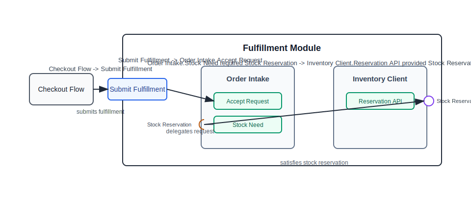

# Fulfillment Module

Fulfillment accepts paid checkout orders and starts stock reservation work.

Related reading: [Checkout flow](../02-flows/checkout.md) and [Inventory model](../05-models/inventory.md).

## 模块边界图（Module Boundary Map）

Source model: [`fulfillment.whitebox.yaml`](./fulfillment.whitebox.yaml)

Converted from the old module map without changing these confirmed facts:

- Checkout flow starts fulfillment through the Submit Fulfillment boundary port.
- Submit Fulfillment is delegated to Order Intake.
- Order Intake delegates stock reservation needs to Inventory Client.

Evidence:

- Evidence: `src/fulfillment/FulfillmentController.ts`
- Evidence: `src/fulfillment/OrderIntake.ts`
- Evidence: `src/fulfillment/InventoryClient.ts`

Uncertainty preserved:

- Cancellation from Returns is mentioned as a future boundary candidate, not confirmed. It stays out of the source model until confirmed.
