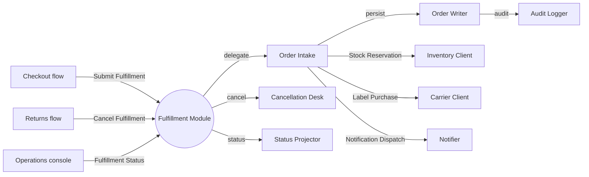

# Fulfillment Module

Fulfillment accepts paid checkout orders and starts stock reservation work.

Related reading: [Checkout flow](../02-flows/checkout.md) and [Inventory model](../05-models/inventory.md).

## Old Module Map

The old map was hand-written before the Whitebox Component Diagram guidance:

- Checkout flow starts fulfillment through the Submit Fulfillment boundary port. Evidence: `src/fulfillment/FulfillmentController.ts`.
- Returns flow asks Fulfillment through the Cancel Fulfillment boundary port. Evidence: `src/fulfillment/FulfillmentController.ts`.
- Operations console reads fulfillment through the Fulfillment Status boundary port. Evidence: `src/fulfillment/StatusController.ts`.
- Submit Fulfillment is delegated to Order Intake. Evidence: `src/fulfillment/OrderIntake.ts`.
- Cancel Fulfillment is delegated to Cancellation Desk. Evidence: `src/fulfillment/CancellationDesk.ts`.
- Fulfillment Status is delegated to Status Projector. Evidence: `src/fulfillment/StatusProjector.ts`.
- Order Intake passes accepted orders to Order Writer. Evidence: `src/fulfillment/OrderWriter.ts`.
- Order Writer publishes audit records to Audit Logger. Evidence: `src/fulfillment/AuditLogger.ts`.
- Order Intake delegates stock reservation needs to Inventory Client through the Stock Reservation interface. Evidence: `src/fulfillment/InventoryClient.ts`.
- Order Intake delegates label purchase needs to Carrier Client through the Label Purchase interface. Evidence: `src/fulfillment/CarrierClient.ts`.
- Order Intake delegates notification dispatch needs to Notifier through the Notification Dispatch interface. Evidence: `src/fulfillment/Notifier.ts`.
- Manual cancellation follow-up is mentioned as a future boundary candidate, not confirmed.

