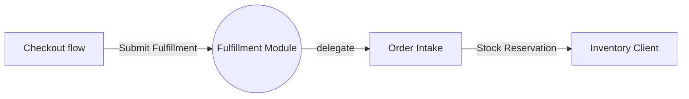

# Fulfillment Module

Fulfillment accepts paid checkout orders and starts stock reservation work.

Related reading: [Checkout flow](../02-flows/checkout.md) and [Inventory model](../05-models/inventory.md).

## Old Module Map

The old map was hand-written before the Whitebox Component Diagram guidance:

- Checkout flow starts fulfillment through the Submit Fulfillment boundary port. Evidence: `src/fulfillment/FulfillmentController.ts`.
- Submit Fulfillment is delegated to Order Intake. Evidence: `src/fulfillment/OrderIntake.ts`.
- Order Intake delegates stock reservation needs to Inventory Client through the Stock Reservation interface. Evidence: `src/fulfillment/InventoryClient.ts`.
- Cancellation from Returns is mentioned as a future boundary candidate, not confirmed.

